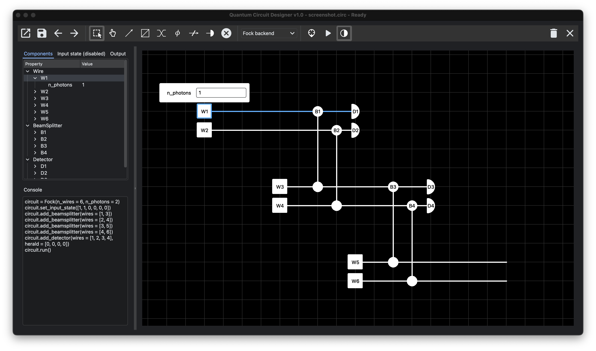

[](https://opensource.org/licenses/Apache-2.0)

Quantum Circuit Builder is a GUI for designing and simulating quantum linear optical circuits.

## Key features
* Easy, intuitive way to design new circuits by drawing components on an interactive canvas
* Simulate the state probabilities generated by new circuit diagrams
* Includes both gate-based and photonic simulators
* Save and load circuit designs
* Benchmark performance metrics for different industry simulators

## List of implemented backends
### Photonic
* Fock space backend (demo)
* Matrix permanent backend (demo)
* [Strawberry fields](https://github.com/XanaduAI/strawberryfields) Fock backend
* [Perceval](https://github.com/Quandela/Perceval) Naive backend
### Gate-based
* Matrix product (demo)

## Installation
Clone the repository using
```
git clone https://github.com/jcsteinmetz/quantum-circuit-designer
cd quantum-circuit-designer
```
then install the package by running
```
pip install .
```

## Screenshot

